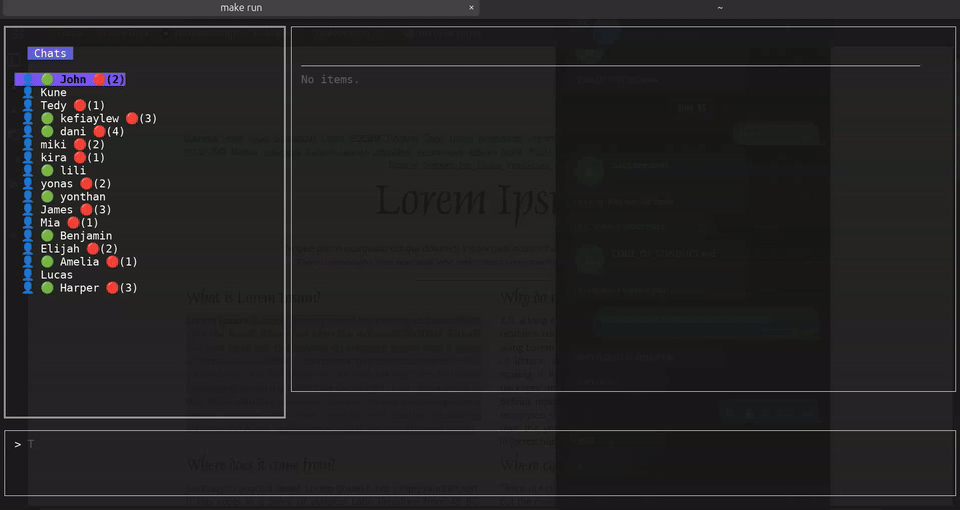

# CliGram
This is a Telegram CLI client made with TypeScript and Node.js.

Right now, you can only chat with personal chats and channels. Group and bot support is coming soon!

---

## Demo



## Limitations and Intended Use

CliGram is designed as a lightweight and minimalistic Telegram client for basic use cases. While it provides essential functionality for interacting with personal chats, channels, and groups, it is not intended to replace GUI-based Telegram clients. Some advanced features available in GUI clients are currently missing, including:

- **Bot Interaction**: Support for interacting with Telegram bots is not yet implemented (coming soon).
- **Media Management**: Advanced media viewing, editing, and management features are not available.
- **Voice and Video Calls**: CliGram does not support voice or video calls.
- **Rich Media Previews**: Inline previews for links, videos, and other rich media are not displayed.
- **Advanced Group Management**: Features like managing group permissions, polls, and pinned messages are not supported.
- **Multi-Account Support**: Currently, only a single Telegram account can be used at a time.

CliGram is ideal for users who prefer a terminal-based interface for basic messaging tasks. For a complete Telegram experience, we recommend using the official Telegram desktop or mobile applications.

---

## Implemented
- [x] Channels  
- [x] Groups  
- [x] Personal chats  

## How to Use It

When you start it up, you'll see three main parts:

1.  **Sidebar**: Lists all your personal chats (takes up about 30% of your screen).
2.  **Chat Area**: Where the chat messages show up (takes up the other 70%).
3.  **Help Page**: The first thing you'll see, it tells you how to get around.

## Initial Setup

First, get your `api_id` and `api_hash` from [Telegram](https://my.telegram.org/apps).

### Set environment Variables

If you're on a Unix-based system like Linux or macOS, set your `api_id` and `api_hash` in your `.zshrc` or `.bashrc` file:

```bash
export TELEGRAM_API_ID=your_api_id_from_telegram
export TELEGRAM_API_HASH=your_api_hash_from_telegram
```

### Set environment Variables (Windows)

If you're on Windows, you can set your `api_id` and `api_hash` as environment variables using the Command Prompt or PowerShell:

#### Using Command Prompt:
```cmd
set TELEGRAM_API_ID=your_api_id_from_telegram
set TELEGRAM_API_HASH=your_api_hash_from_telegram
```

#### Using PowerShell:
```powershell
$env:TELEGRAM_API_ID="your_api_id_from_telegram"
$env:TELEGRAM_API_HASH="your_api_hash_from_telegram"
```

To make these variables persistent across sessions, you can add them to your system's environment variables:

1. Open the Start Menu and search for "Environment Variables."
2. Click on "Edit the system environment variables."
3. In the System Properties window, click on the "Environment Variables" button.
4. Under "System variables" or "User variables," click "New" and add:
   - **Variable name**: `TELEGRAM_API_ID`
   - **Variable value**: `your_api_id_from_telegram`
5. Repeat the process for `TELEGRAM_API_HASH`.
6. Click "OK" to save and close all windows.

After setting the variables, restart your terminal to apply the changes.

# Installation

You can download pre-built binaries for your operating system (Linux, macOS) from the [releases page](https://github.com/Kumneger0/cligram/releases).

## Build from Source

For instructions on building from source, please see [install.md](install.md).

## Using Docker

Here's the Docker command to run the app:

```bash
docker run --rm -it -v tele_cli_data:/root/.cligram -e TELEGRAM_API_ID=$TELEGRAM_API_ID -e TELEGRAM_API_HASH=$TELEGRAM_API_HASH kumneger/cligram:latest
```

### Why is the Docker Command Long?

By default, cligram stores the user's session information in a hidden folder called `.cligram` in the user's home directory. Docker containers have their own file system, which is isolated from the host machine. To prevent the need for re-authenticating the user every time, we create a Docker volume and bind it to the container. This allows us to persist the session information across container restarts.

Additionally, we pass the Telegram API ID and API Hash as environment variables (`TELEGRAM_API_ID` and `TELEGRAM_API_HASH`). These are required for cligram to authenticate and interact with the Telegram API.

If the command is too long, you can create an alias to make it easier to use.

## Before You Start

- **Login**: Use `cligram login` in your terminal and follow the prompts.
- **Logout**: Use `cligram logout` when you're done.

## The Look

- Sidebar takes 30% of the width.
- Chat area fills the rest.
- Uses the full height of your terminal.
- Nice rounded borders separate everything.

## Getting Around

- **Tab**: Switch between the sidebar and the chat area (active section has a green border).
- **↑** or **k**: Move up (works in both chat list and messages).
- **↓** or **j**: Move down (works in both chat list and messages).
- **ctrl + k** : To Open up search menu
- **c**: Switch to Channels (Sidebar specific).
- **g**: Switch to Groups(Sidebar specific))
- **u**: Switch back to users (Sidebar specific).

## Doing Things

- **Message Actions**: When you've got a message selected in the chat area:
  - **d** to delete it.
  - **r** to reply to it.
  --**e** to edit message
  - **f** to forward it.
  - **u** to open direct message with the user (in group chats, this lets you quickly start a private conversation with any message sender)
 

## Working with the Message Input

- **ctrl + a**: When input is focused, opens or closes the file picker to attach a file (requires zenity to be installed)
- When a file is selected, you can add an optional caption or just press Enter to send the file as is
- File upload progress is displayed while sending

## Configuration Management

customize your cligram experience by managing your own configuration using a JSON file. The configuration file is located at `~/.cligram/user.config.json`.

### Configuration Options

All configuration options are optional. Here are all available options with their possible values and defaults:

```json
{
  "chat": {
    "sendTypingState": true,
    "readReceiptMode": "default"
  },
  "privacy": {
    "lastSeenVisibility": "everyone"
  },
  "notifications": {
    "enabled": true,
    "showMessagePreview": true
  }
}
```

Here's what each setting does:

#### Chat Settings

- `sendTypingState`: Controls whether others see "typing..." when you're composing a message
  - `true`: Show typing status (default)
  - `false`: Never show typing status
- `readReceiptMode`: Controls when messages are marked as read
  - `"default"`: Only marks messages as read when you actively interact with them (like replying). the sender won't see the "read" checkmarks until you take action on their messages.
  - `"instant"`: Marks messages as read immediately when you view them in the chat area. The sender will see "read" checkmarks as soon as you look at their messages.
  - `"never"`: Messages are never automatically marked as read, even when you interact with them. The sender will always see their messages with unread status.

#### Privacy Settings

- `lastSeenVisibility`: Controls who can see when you were last online
  - `"everyone"`: Anyone can see your last seen time
  - `"contacts"`: Only your contacts can see your last seen time
  - `"nobody"`: No one can see your last seen time
  - If not set: Uses your existing Telegram privacy settings

#### Notification Settings

- `enabled`: Master switch for notifications
  - `true`: Show notifications (default)
  - `false`: Disable all notifications
- `showMessagePreview`: Controls notification content
  - `true`: Show message content in notifications (default)
  - `false`: Only show sender name, hide message content

All settings are optional - if you omit any setting, cligram will use the default value. You can modify the configuration file at any time - changes will take effect the next time you start the application.

## Contributing

We welcome contributions to cligram! For detailed guidelines, please refer to the [CONTRIBUTING.md](CONTRIBUTING.md) file.

If you encounter any issues or have suggestions, feel free to open an issue on our GitHub repository. This is also a great way to contribute to the project.

Thank you for your interest in improving cligram!

## 🤝 Code of Conduct

We are committed to providing a welcoming and inclusive experience for everyone. We expect all participants in our community to abide by our [Code of Conduct](CODE_OF_CONDUCT.md). Please read it to understand what behaviors will and will not be tolerated.

## License

This project is licensed under the MIT License. See the [LICENSE](LICENSE) file for details.
