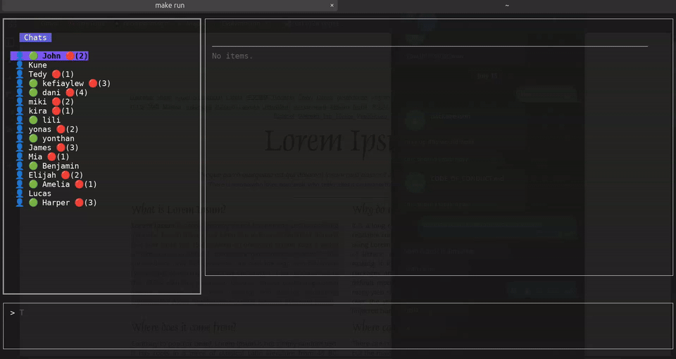

# cligram

cligram is a Telegram client written in Go Programming language.

For full documentation, please visit: [kumneger0.github.io/cligram](https://kumneger0.github.io/cligram)

## Demo

## Features

*   View user stories anonymously (the owner won't be notified).
*   Read messages anonymously (the sender won’t know when you’ve read them).
*   Send and receive messages.
*   Chat with users, groups, and channels.
*   File attachments.

## Contributing

We welcome contributions to cligram! For detailed guidelines, please refer to the [CONTRIBUTING.md](CONTRIBUTING.md) file.

If you encounter any issues or have suggestions, feel free to open an issue on our GitHub repository. This is also a great way to contribute to the project.

Thank you for your interest in improving cligram!

## 🤝 Code of Conduct

We are committed to providing a welcoming and inclusive experience for everyone. We expect all participants in our community to abide by our [Code of Conduct](CODE_OF_CONDUCT.md). Please read it to understand what behaviors will and will not be tolerated.

## Disclaimer

> [!WARNING]
>
> **Use at your own risk.** This application breaks Telegram's <a href="https://core.telegram.org/api/terms" target="_blank">developer TOS</a> to implement "**ghost mode**" features (anonymous story viewing and message reading). Users are solely responsible for ensuring their use of this application complies with the TOS. By using this application, you acknowledge and accept all risks, including potential account termination. The developers are not responsible for any consequences arising from the use of this software.

## License

This project is licensed under the MIT License. See the [LICENSE](LICENSE) file for details.

